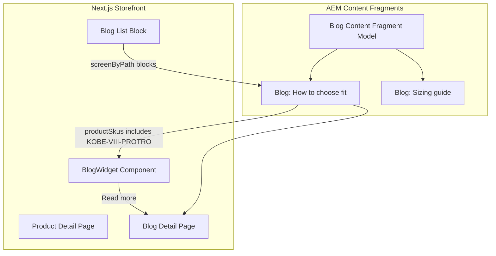

# AEM Blog Component with Content Fragments

## Current State

- **PDP blog widget** (`[components/product-detail/product-detail.jsx](components/product-detail/product-detail.jsx)`): Hardcoded `BLOG_POST` constant (title, excerpt, image, linkText). Pencil links to AEM editor at `content/site/product/${productSlug}`.
- **AEM integration**: Uses `@adobe/aem-headless-client-js`, persisted query `v0/screenByPath` for screens, `ModelManager` maps blocks (Hero, ProductCollection, CategoryGrid) to components.
- **Image handling**: `[OptimizedImage](components/optimizedimage.jsx)` for AEM assets (`_dynamicUrl`/`_authorUrl`); `[mapJsonRichText](lib/renderRichText.js)` for rich text.

## Architecture




## 1. AEM Content Fragment Model (Blog)

Create in AEM Content Fragment Models (Tools > Assets > Content Fragment Models):


| Field         | Type                               | Notes                                                       |
| ------------- | ---------------------------------- | ----------------------------------------------------------- |
| `title`       | Single-line text                   | Required                                                    |
| `excerpt`     | Multi-line text                    | Short summary (used in teaser)                              |
| `image`       | Content Reference (Image)          | Featured image                                              |
| `author`      | Single-line text                   | Author name                                                 |
| `body`        | Rich Text                          | Full blog body                                              |
| `urlSlug`     | Single-line text                   | URL-friendly slug for `/blog/[slug]`                        |
| `productSkus` | Multi-field (text, allow multiple) | Product SKUs this blog relates to (e.g. `KOBE-VIII-PROTRO`) |


Store fragments under a folder such as `/content/dam/v0/site/en/blog/`.

## 2. AEM GraphQL Persisted Queries

Add persisted queries in AEM GraphQL (Tools > General > GraphQL Query Editor):

`**v0/blogByProductSlug**` – fetch blog(s) that reference a product:

```graphql
query blogByProductSlug($productSlug: String!) {
  blogList(
    filter: {
      productSkus: {
        _expressions: [{ value: $productSlug, _operator: CONTAINS }]
      }
    }
    _assetTransform: { format: WEBP, preferWebp: true }
  ) {
    items {
      _path
      title
      excerpt
      image { _dynamicUrl _authorUrl }
      author
      urlSlug
      body { json }
    }
  }
}
```

*Note: Exact filter syntax depends on your AEM GraphQL schema. If `productSkus` is an array, use `_contains` or equivalent. Adjust per [AEM GraphQL filter docs](https://experienceleague.adobe.com/en/docs/experience-manager-cloud-service/content/assets/extending/graphql-api-content-fragments.html).*

`**v0/blogBySlug`** – fetch single blog by `urlSlug` for full post page:

```graphql
query blogBySlug($slug: String!) {
  blogList(filter: { urlSlug: { _expressions: [{ value: $slug }] } }, ...) {
    items { ... }
  }
}
```

`**v0/blogList**` – list blogs (for home/slug page blocks):

```graphql
query blogList($limit: Int) {
  blogList(_assetTransform: {...}) {
    items { title excerpt image urlSlug ... }
  }
}
```

## 3. Storefront Implementation

### 3.1 API Route for AEM Blog

Create `[app/api/aem/blog/route.js](app/api/aem/blog/route.js)`:

- **GET** `?productSlug=kobe-VIII-protro` → run `v0/blogByProductSlug`, return first matching blog (or null).
- **GET** `?slug=how-to-choose-fit` → run `v0/blogBySlug`, return single blog.
- **GET** `?list=true&limit=5` → run `v0/blogList` for listing.

Uses `AEMHeadless` with `serviceURL` from config (same pattern as nav/main content). Config can come from `localStorage` (client) or env vars for server-side.

### 3.2 BlogWidget Component

Create `[components/blog-widget/blog-widget.jsx](components/blog-widget/blog-widget.jsx)`:

- **Props**: `blog` (AEM fragment data), `config`, `productSlug`, `showPencil` (when `?vse=`).
- **Renders**: Image, title, excerpt, optional author, "Read more" link to `/blog/[urlSlug]`.
- **UE/AEM edit**: Pencil links to AEM editor for the blog fragment path (`content/dam/.../blog/...`) when `showPencil` is true.
- **Fallback**: If `blog` is null, render nothing or a placeholder (configurable).

Reuse existing CSS from `[product-detail.css](components/product-detail/product-detail.css)` (`.product-detail-blog-post-`*) or extract shared styles into `blog-widget.css`.

### 3.3 Product Detail Page Integration

In `[components/product-detail/product-detail.jsx](components/product-detail/product-detail.jsx)`:

- Add `useEffect` to fetch blog via `/api/aem/blog?productSlug=${productSlug}` (or pass from parent).
- Replace hardcoded `BLOG_POST` section with `<BlogWidget blog={blogData} config={config} productSlug={productSlug} showPencil={!!vse} />`.
- Remove `BLOG_POST` constant and inline blog markup.

### 3.4 Blog Detail Page

Create `[app/blog/[slug]/page.jsx](app/blog/[slug]/page.jsx)`:

- Fetch blog by `slug` via `/api/aem/blog?slug=${slug}`.
- Render full post: title, author, image, body (using `mapJsonRichText` for `body.json`).
- Add `data-aue-resource` for UE editing of the blog fragment.
- 404 if not found.

### 3.5 Blog Block for Screens (Optional)

To use blog posts on home/slug pages (like Amplience content chooser):

- Add **Blog** block type to `[components/model-manager.jsx](components/model-manager.jsx)` `componentMapping`.
- Create `BlogBlock` component that receives `content` from AEM (block with `blogRef` or inline blog data).
- AEM screen block model would have a content fragment reference to a Blog; GraphQL returns the referenced fragment.

*This step depends on your AEM screen/block structure. If blocks can reference content fragments, add it; otherwise defer.*

## 4. Config and AEM Environment

The blog API needs AEM `serviceURL` and project. Options:

- **Client-side**: Read from `localStorage` (same as `app/[...slug]/page.js`) and call API from client.
- **Server-side**: Use `NEXT_PUBLIC_AEM_EDITOR_URL` (or similar) and `NEXT_PUBLIC_AEM_PROJECT` in the API route for server-side fetch.

Recommend passing `config` (env, project) from the page into `ProductDetail`, and having the blog fetch use that config (or a dedicated `/api/aem/blog` that reads from request headers/cookies if needed).

## 5. File Summary


| Action   | File                                                                                             |
| -------- | ------------------------------------------------------------------------------------------------ |
| Create   | `app/api/aem/blog/route.js` – blog API                                                           |
| Create   | `components/blog-widget/blog-widget.jsx`                                                         |
| Create   | `components/blog-widget/blog-widget.css` (or reuse product-detail styles)                        |
| Create   | `app/blog/[slug]/page.jsx` – full blog post page                                                 |
| Modify   | `components/product-detail/product-detail.jsx` – integrate BlogWidget, fetch blog by productSlug |
| Optional | `components/model-manager.jsx` – add Blog block for screens                                      |


## 6. AEM Setup Checklist (for your AEM admin)

1. Create Content Fragment Model **Blog** with fields above.
2. Enable GraphQL for the project (Configuration Browser).
3. Create and persist `v0/blogByProductSlug`, `v0/blogBySlug`, `v0/blogList`.
4. Create sample blog fragments and set `productSkus` to include `KOBE-VIII-PROTRO` for testing.

