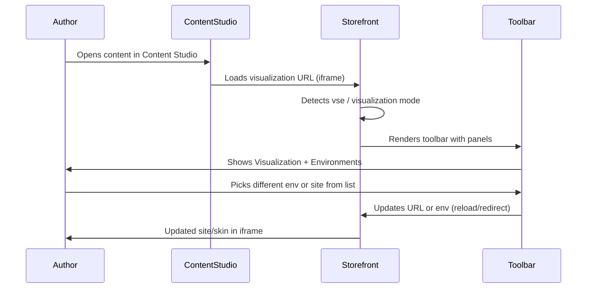

# Amplience storefront and Universal Editor–style integration

## Clarification: two different “editors”

Your codebase already has **Adobe Universal Editor** wired to **AEM** (`[components/universal-editor-connection.jsx](components/universal-editor-connection.jsx)`, `data-aue-resource` on AEM-driven components). The [Amplience SFCC Composable Commerce](https://github.com/amplience/amplience-sfcc-composable-commerce) repo does **not** use Adobe UE; it uses **Amplience Content Studio** and a **storefront toolbar** for the “editor” experience.

- **Adobe UE (current):** In-context editing for AEM content; connection via `urn:adobe:aue:system:aemconnection` and AEM author URL.
- **Amplience “editor” experience:** Content Studio opens your storefront in an **iframe** via a **visualization URL**. When that URL is loaded, a **toolbar** appears on the storefront (Preview, Visualization, Environments, Personalisation). That toolbar is what “site tools” and “skinning” refer to: switching **which storefront URL** and **which Amplience environment** (e.g. UAT vs Live) to use for preview.

So “skinning the site tools turned on once inside the Universal Editor” in the Amplience world means: **turning on the Amplience toolbar** when the storefront is opened from Content Studio (visualization mode), and using the **Environments** and **Visualization** panels to choose site/environment. Below is how to pull that into your app.

---

## What to pull from amplience-sfcc-composable-commerce

### 1. Config pattern (visualisations + environments = “skinning”)

**Source:** `[config/amplience/default.js](https://github.com/amplience/amplience-sfcc-composable-commerce/blob/main/config/amplience/default.js)`

- `**visualisations`:** List of named storefront URLs (e.g. Localhost, Production, UAT). These are the “skins”/sites authors choose in Content Studio.
- `**envs`:** List of Amplience environments (hub + VSE URL) for switching backend/preview (e.g. Live vs UAT).
- `**default.hub`:** Default Amplience hub name.

**In your codebase:** Add a small Amplience config (e.g. `config/amplience.js` or values in `[lib/constants.ts](lib/constants.ts)`) with `visualisations` and `envs` so the toolbar can offer environment/site switching. No PWA Kit dependency.

### 2. Visualization route and real-time visualization page

**Source:**  

- Route: `app/routes.jsx` — `path: '/visualization/:hubname/:contentId'`  
- Page: `app/pages/amplience/realtime-visualization/index.jsx`  
- Docs: [visualization.md](https://github.com/amplience/amplience-sfcc-composable-commerce/blob/main/docs/amplience/visualization.md)

Content types in Amplience are configured with a visualization URL like:  
`http://localhost:3000/visualization/{{hub.name}}/{{content.sys.id}}?vse={{vse.domain}}`

When an author opens content in Content Studio, that URL loads your storefront in an iframe; the page must render the single content item and accept `vse` (and optionally locale) for preview.

**In your codebase:** Add a Next.js route, e.g. `app/visualization/[hubName]/[contentId]/page.jsx`, that:  

- Reads `hubName`, `contentId`, and `vse` (and locale) from the URL.  
- Fetches that content from Amplience (Delivery API with VSE for preview).  
- Renders it with the **toolbar** (see below) so “site tools” are visible in the editor.  
- Optionally integrates **dc-visualization-sdk** for real-time prop updates while editing (same pattern as their `realtime-visualization` page).

### 3. Toolbar (“site tools” in the editor)

**Source:**  

- `app/components/amplience/toolbar/index.jsx` (panel list and renderer)  
- Panels under `app/components/amplience/toolbar/` (Preview, Visualization, Environments, Personalisation, About)  
- [toolbar-framework.md](https://github.com/amplience/amplience-sfcc-composable-commerce/blob/main/docs/amplience/toolbar-framework.md)

The toolbar is the “site tools” that appear when the site is opened from Content Studio: **Environments** = switch Amplience env (and effectively “skin”/site), **Visualization** = show/copy VSE, hub, locale, content ID.

**In your codebase:**  

- Port the toolbar component and the panels you need (at least Visualization + Environments for skinning).  
- Render the toolbar only when in visualization mode (e.g. when `vse` or a specific query param is present, or when a layout segment is `visualization`).  
- Replace Chakra UI with your stack (e.g. Radix/shadcn or Tailwind) if you don’t use Chakra.  
- Feed it `visualisations` and `envs` from your Amplience config so switching environment/site works.

### 4. Amplience content API and delivery

**Source:** `app/amplience-api/` — ContentClient (`dc-delivery-sdk-js`), fetch by id/key, Filter API, hierarchy, enrich (e.g. personalisation).

**In your codebase:**  

- Add `dc-delivery-sdk-js` (and optionally `dc-visualization-sdk` for real-time).  
- Implement a small Amplience API layer (content by id, optional hierarchy/slots) and use it in the visualization page and any Amplience-driven components.  
- Use the same VSE and hub from URL/config so preview and environment switching stay in sync.

### 5. Request/SSR handling for VSE and preview

**Source:** `app/request-processor.js` and SSR handling of `vse` and related query params.

**In your codebase:** In the visualization route (and any Amplience-rendering routes), read `vse`, `locale`, and (if needed) timestamp from the request (Next.js `searchParams`). Pass them into the Amplience client and into the toolbar so preview and environment switching work correctly.

### 6. Content components and wrapper (optional, for full CMS-driven pages)

**Source:** `app/components/amplience/wrapper/`, banner, hero, promo, card-list, product-tile, etc., and `app/page-designer/` for slot composition.

Use these as reference to render Amplience content types (e.g. hero, banner) in your existing pages. You can start with the visualization route rendering a single content item and a simple wrapper; add more component types as you add content types in Amplience.

### 7. Storefront and product (PDP/PLP) content — what can be pulled in

In the Amplience repo, “storefront” and “product creation” mean **content-driven storefront structure** and **content attached to product/category pages** (not creating product catalog data; catalog stays in SFCC or, in your case, Adobe Commerce). The following can be pulled into your Next.js storefront.

#### 7a. Storefront structure (navigation, slots, page composition)

- **Navigation from Amplience** ([navigation.md](https://github.com/amplience/amplience-sfcc-composable-commerce/blob/main/docs/amplience/navigation.md)): Header and footer are driven by **hierarchies** with fixed **delivery keys** (e.g. `main-nav`, `footer-nav`). The app fetches by key via the Delivery API (and Filter API). Node types: Root, Group, Category, Content Page, External link, Internal link. You can pull the pattern: fetch nav by key in layout or a nav component, render from hierarchy; use your own catalog/category IDs (Adobe Commerce) instead of SFCC.
- **Slots / page composition:** Home and content pages use **slot** content (e.g. `home/slot/top`) fetched by key and rendered with **AmplienceWrapper**. The wrapper maps content `_meta.schema` to a React component and passes props. Pull: `app/components/amplience/wrapper/index.jsx` and the [AmplienceWrapper component doc](https://github.com/amplience/amplience-sfcc-composable-commerce/blob/main/docs/amplience/ampliencewrapper-component.md); adapt the component map to your schema IDs and components (hero, banner, card-list, etc. from [amplience-components-list.md](https://github.com/amplience/amplience-sfcc-composable-commerce/blob/main/docs/amplience/amplience-components-list.md)).
- **Content-driven pages:** “Content Page” nodes link to a content item; the app routes to that content (e.g. page designer or slug). In Next.js you’d map Amplience content or delivery key to a route (e.g. `app/[...slug]/page.js`) and optionally keep AEM for some routes.

#### 7b. Product Details Page (PDP) content

**Source:** [product-details-page-management.md](https://github.com/amplience/amplience-sfcc-composable-commerce/blob/main/docs/amplience/product-details-page-management.md), `app/pages/amplience/product-detail/index.jsx`

- **Product PDP content type:** One content type per product (or one “Product PDP” type) with an **enforced delivery key** `pdp/content/{SKU}`. So every PDP has a deterministic key from the product ID.
- **Fetch in page:** In getProps (PWA Kit) they fetch `ampClient.fetchContent([{ key: \`pdp/content/${productId.toUpperCase()} }], { locale })`. In your stack: in the PDP page (e.g.` app/product/[...slug]/page.jsx`or equivalent), fetch by key in the server component or in`getServerSideProps`-style data fetch, using your product id/sku from Adobe Commerce.
- **Render:** If `productPdp?.active` and `productPdp.content` exist, loop and render each item with `<AmplienceWrapper content={content} fetch={{ id: content._meta.deliveryId }} />`. That lets authors attach one or many content blocks (hero, banner, shoppable image, etc.) to a PDP.
- **Visualization for PDP:** They add a route `/pdp/content/:productId` that loads the same PDP with that product’s Amplience content so authors can visualise PDP content in Content Studio. You can add `app/pdp/content/[productId]/page.jsx` (or under visualization) that fetches by key `pdp/content/{productId}` and renders with the toolbar; optionally use `useState` + real-time SDK so edits in Content Studio update the iframe.

#### 7c. Product Listing Page (PLP) content

**Source:** [product-listing-page-management.md](https://github.com/amplience/amplience-sfcc-composable-commerce/blob/main/docs/amplience/product-listing-page-management.md), `app/pages/amplience/product-list/index.jsx`

- **Category-level content:** Category (or “category page”) content holds **content references** (not full content) for:
  - **Top content** — list of content/slots above the grid (SSR fetch, then render with AmplienceWrapper).
  - **Bottom content** — below the fold (they pass refs to AmplienceWrapper and let it fetch by id client-side, or you can SSR).
  - **In-grid content** — items with position and size (columns/rows); products are pushed along, not overwritten. Uses [dc-extension-grid](https://github.com/amplience/dc-extension-grid) in Content Studio for WYSIWYG placement (max 3×3); your app consumes the `gridItem` array and interleaves content tiles with product tiles by position.
- **Fetching:** They batch-fetch multiple content references in one multi-fetch call. Top content: extract ids from refs, `ampClient.fetchContent(ids, { locale })`. Bottom/grid: same client, or pass refs to wrapper for client fetch.
- **Real-time visualization (PLP):** They use `useAmpRtv` so when the content model changes in Content Studio, they refetch top content refs and `gridItem` and update state so the PLP in the iframe updates. You can port that pattern (effect + real-time SDK) to your PLP when in visualization mode.
- **Product tile:** They swap the default product tile for `AmplienceProductTile` for look-and-feel; optional to pull.

**Adaptation to your stack:** Your commerce data comes from **Adobe Commerce** (Commerce Optimizer GraphQL), not SFCC. So: keep your existing product and category data source; add Amplience only for **content** (nav, slots, PDP content, PLP top/bottom/in-grid). Fetch Amplience by delivery key or id in the same PDP/PLP pages where you already fetch product/category, then render Amplience blocks via AmplienceWrapper alongside your existing `[components/product-detail/product-detail.jsx](components/product-detail/product-detail.jsx)` and product list components.

#### 7d. Summary: what to pull for storefront + product (PDP/PLP)

| Area              | What to pull                                                                                                                                     | Your adaptation                                                                                                                                                                  |
| ----------------- | ------------------------------------------------------------------------------------------------------------------------------------------------ | -------------------------------------------------------------------------------------------------------------------------------------------------------------------------------- |
| **Nav**           | Hierarchy fetch by key (`main-nav`, `footer-nav`), node types and rendering                                                                      | Fetch in layout or nav component; map category links to your Adobe Commerce catalog where needed                                                                                 |
| **Slots / pages** | AmplienceWrapper, slot keys (`home/slot/top`), component map                                                                                     | Next.js layout or page fetches by key; wrapper maps schema → component; use your schema IDs                                                                                      |
| **PDP content**   | Product PDP content type with key `pdp/content/{SKU}`, fetch + AmplienceWrapper loop, optional `/pdp/content/:productId` route for visualization | In PDP page, fetch product (existing) + Amplience by key; render product detail + Amplience blocks; add visualization route if you want in-Content Studio preview                |
| **PLP content**   | Category content with topContent, bottomContent, gridItem; batch fetch; AmplienceWrapper; useAmpRtv for real-time                                | In PLP/category page, fetch category (existing) + Amplience category content; render top / grid (with position rules) / bottom; optional real-time refetch when in visualization |
| **Components**    | Hero, banner, card-list, promo, shoppable-image, etc.                                                                                            | Port the ones you need; map to your Amplience schema IDs                                                                                                                         |

### 8. Docs and automation (reference only)

- **Docs:** [docs/amplience/](https://github.com/amplience/amplience-sfcc-composable-commerce/tree/main/docs/amplience) — visualization, preview, toolbar-framework, amplience-config, navigation, product-details-page-management, product-listing-page-management, ampliencewrapper-component, amplience-components-list — useful for implementation and for content type setup (visualization URL template) in Amplience.  
- **Automation:** `amplience-automation/` and `scripts/amplience/` — schemas and import scripts; use if you want to define content types and slots in code; not required for the toolbar/skinning flow.

---

## How “skinning” and “site tools” work once in the editor

- **Visualizations** in config = the list of storefront URLs (“sites”) that can be registered in Amplience content types and selected for preview.  
- **Environments** in config = the list of Amplience envs (hub + VSE); the **Environments** panel in the toolbar lets authors switch between them.  
- So “skinning the site” = choosing which of these URLs and which environment to use when viewing the site inside Content Studio; the toolbar is what makes that choice available.

---

## Implementation order (high level)

1. **Config** — Add Amplience config (hub, `visualisations`, `envs`) and env vars for API keys / hub.
2. **Delivery API** — Add `dc-delivery-sdk-js` and a thin content fetch layer (by id/key, with VSE support).
3. **Visualization route** — Add `app/visualization/[hubName]/[contentId]/page.jsx` that reads `vse`/locale, fetches content, and renders one content item.
4. **Toolbar** — Port toolbar + Visualization + Environments panels; render only in visualization mode; wire to config for env/site list.
5. **Content Studio setup** — In Amplience, set the content type visualization URL to your storefront (e.g. `https://your-site/visualization/{{hub.name}}/{{content.sys.id}}?vse={{vse.domain}}`).
6. **(Optional)** Real-time — Add `dc-visualization-sdk` on the visualization page so edits in Content Studio update the iframe without reload.
7. **Storefront and product (PDP/PLP)** — AmplienceWrapper + component map; nav by delivery key; PDP content by key `pdp/content/{SKU}` in your PDP page; PLP top/bottom/in-grid content in your category page; optional PDP/PLP visualization routes and real-time refetch (useAmpRtv-style) when in Content Studio.

---

## Coexistence with Adobe Universal Editor

- **AEM content** continues to use **Adobe UE** and `data-aue-resource`; no change required.  
- **Amplience content** is edited in **Amplience Content Studio**; the “editor” for that content is the visualization iframe + toolbar.  
- If you want a single “universal” surface later, you’d need either to surface both in one page (AEM + Amplience) and use two editor UIs (Adobe UE for AEM, Content Studio for Amplience), or to build a custom Adobe UE connection to Amplience (out of scope here).

---

## Summary

| Goal                                                                  | What to pull                                                                                                                | Where it goes                                                                                                                             |
| --------------------------------------------------------------------- | --------------------------------------------------------------------------------------------------------------------------- | ----------------------------------------------------------------------------------------------------------------------------------------- |
| **Skinning / site tools in “the editor”**                             | Toolbar + Visualization + Environments panels; `visualisations` and `envs` config                                           | Layout or visualization page; show toolbar only in visualization mode; config in `config/amplience.js` or `lib/constants.ts`              |
| **Storefront shows in Amplience “Universal Editor” (Content Studio)** | Visualization route + real-time visualization page pattern                                                                  | `app/visualization/[hubName]/[contentId]/page.jsx`; register same URL pattern in Amplience content types                                  |
| **Fetch Amplience content**                                           | `app/amplience-api/` + `dc-delivery-sdk-js`                                                                                 | New `lib/amplience/` or `app/api/` + server components / route handlers                                                                   |
| **Storefront structure**                                              | Nav by key (main-nav, footer-nav), slots by key, AmplienceWrapper + component map                                           | Layout/nav component; page slots; `components/amplience/wrapper` and schema→component mapping                                             |
| **PDP content**                                                       | Product PDP type with key `pdp/content/{SKU}`; fetch + AmplienceWrapper loop                                                | PDP page: fetch product + Amplience by key; render product detail + content blocks; optional `/pdp/content/[productId]` for visualization |
| **PLP content**                                                       | Category content (topContent, bottomContent, gridItem); batch fetch; in-grid rules                                          | Category/PLP page: fetch category + Amplience; render top/grid/bottom; optional useAmpRtv-style real-time in visualization                |
| **Reference**                                                         | Docs: visualization, toolbar-framework, amplience-config, navigation, PDP/PLP management, AmplienceWrapper, components list | Your `docs/` or internal runbook for Content Studio setup and toolbar customization                                                       |

This gives you a clear path to reuse the Amplience repo for storefront content and for the “site tools” (toolbar) experience when the site is opened inside Amplience Content Studio, while keeping your existing Adobe Universal Editor (AEM) integration as-is.