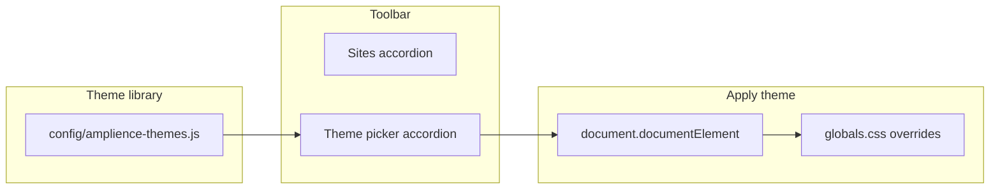

# Amplience theme/skin picker accordion (below Sites)

## Goal

- **Keep** the existing "Sites" accordion and its props (open current page on another storefront URL).
- **Add** a new accordion **below** "Sites" that lets authors pick a **visual theme** for the current site (e.g. "Blue theme – white text" or "Green theme – white text"). Selection applies immediately to the page and can be persisted for the session.

## Architecture

- **Theme library**: Static list of themes (id, name, CSS class or data-attr). No URL; each theme defines visual tokens (background + text).
- **Toolbar**: New panel below Sites; lists themes; on click sets theme on `document.documentElement` (and optionally `localStorage`).
- **CSS**: New rules in [app/globals.css](app/globals.css) for each theme (e.g. `[data-amplience-theme="blue"]` overriding `--background` and `--foreground`).

## Implementation

### 1. Theme library (config)

- **New file**: `config/amplience-themes.js`  
  - Export an array of theme definitions, e.g.:
    - `{ id: "default", name: "Default", description: "Default site theme" }` (no override; clears custom theme)
    - `{ id: "blue", name: "Blue", description: "Blue background, white text" }`
    - `{ id: "green", name: "Green", description: "Green background, white text" }`
  - Use string IDs that will be applied as `data-amplience-theme="{id}"` on the document root. No need for inline CSS in the config; CSS lives in globals.

### 2. CSS for each theme

- **File**: [app/globals.css](app/globals.css)  
  - After the existing `:root` / `.dark` block, add selectors that apply when a theme is active, e.g.:
    - `[data-amplience-theme="blue"]` (and optionally `[data-amplience-theme="blue"] .dark` if you support dark-mode variants): set `--background` and `--foreground` to a blue and white (HSL values that work with existing `hsl(var(--background))` usage).
    - `[data-amplience-theme="green"]`: same idea for green background and white text.
  - Use the same variable names the app already uses (`--background`, `--foreground`, etc.) so all components respond without changes.

### 3. Theme picker panel component

- **New file**: `components/amplience/toolbar/theme-picker-panel.jsx`  
  - Props: `themes` (array from library).  
  - Render a list of buttons (or radio-style options) per theme; show `name` and optionally short `description`.  
  - On click: set `document.documentElement.setAttribute("data-amplience-theme", theme.id)`. For "default", remove the attribute (or set to empty string).  
  - Optional: read/write `localStorage` (e.g. key `amplience-theme`) so the choice persists across navigations when the toolbar is used.  
  - Optional: highlight the currently selected theme (read from `document.documentElement.getAttribute("data-amplience-theme")` or from a small client state synced on mount and on click).

### 4. Wire themes into config and API (optional but consistent)

- **Config**: In [config/amplience.js](config/amplience.js), require/import the new theme list and expose it, e.g. `themes: require("./amplience-themes")` (or similar).  
- **API**: In [app/api/amplience/config/route.js](app/api/amplience/config/route.js), add `themes` to the JSON response so the toolbar can fetch themes the same way it fetches `envs` and `visualisations`.  
- **Client fallback**: In [lib/amplience/config-client.js](lib/amplience/config-client.js), add a static `themes` array (same list or import from a client-safe module) so the theme picker works before the API response.

### 5. Add the new accordion to the toolbar

- **File**: [components/amplience/toolbar/index.jsx](components/amplience/toolbar/index.jsx)  
  - Keep existing items (Visualisation, Environments, Sites) and their props unchanged.  
  - Add a new item **after** Sites, e.g. `value: "3"`, `title: "Theme"` (or "Skin picker"), `Component: ThemePickerPanel`, `visible: themes.length > 0`, `props: { themes }`.  
  - `themes` should come from `serverConfig?.themes ?? staticConfig.themes ?? []` (and static config from `getAmplienceConfig()`).  
  - Extend `openedPanels` default to include `"3"` so the new section can be open by default if desired.

### 6. Apply theme on load (optional)

- If using `localStorage`: in `ThemePickerPanel` (or a small effect in the toolbar when `vse` is present), on mount read `amplience-theme` and set `data-amplience-theme` on `document.documentElement` so the theme is applied as soon as the toolbar loads.

## Files to add

| File                                                  | Purpose                                                                                                            |
| ----------------------------------------------------- | ------------------------------------------------------------------------------------------------------------------ |
| `config/amplience-themes.js`                          | Theme library: id, name, description for default, blue, green (and any others).                                    |
| `components/amplience/toolbar/theme-picker-panel.jsx` | Panel UI: list themes, on select set `data-amplience-theme` on document, optional localStorage and selected state. |

## Files to modify

| File                                                                             | Change                                                                                                                                                     |
| -------------------------------------------------------------------------------- | ---------------------------------------------------------------------------------------------------------------------------------------------------------- |
| [app/globals.css](app/globals.css)                                               | Add `[data-amplience-theme="blue"]` and `[data-amplience-theme="green"]` (and default reset) overrides for `--background` and `--foreground` (HSL values). |
| [config/amplience.js](config/amplience.js)                                       | Expose `themes` from `amplience-themes.js`.                                                                                                                |
| [app/api/amplience/config/route.js](app/api/amplience/config/route.js)           | Return `themes` in the JSON response.                                                                                                                      |
| [lib/amplience/config-client.js](lib/amplience/config-client.js)                 | Add `themes` to the client-side fallback config.                                                                                                           |
| [components/amplience/toolbar/index.jsx](components/amplience/toolbar/index.jsx) | Add fourth accordion item (Theme / Skin picker) below Sites; pass `themes`; include in `openedPanels` if desired.                                          |

## Summary

- **Sites** accordion and its props stay as they are.  
- A new **Theme** accordion below it shows a skin picker from the library (e.g. Default, Blue, Green).  
- Selecting a theme sets `data-amplience-theme` on the document root; CSS in `globals.css` applies the correct background and text color for the whole site.

