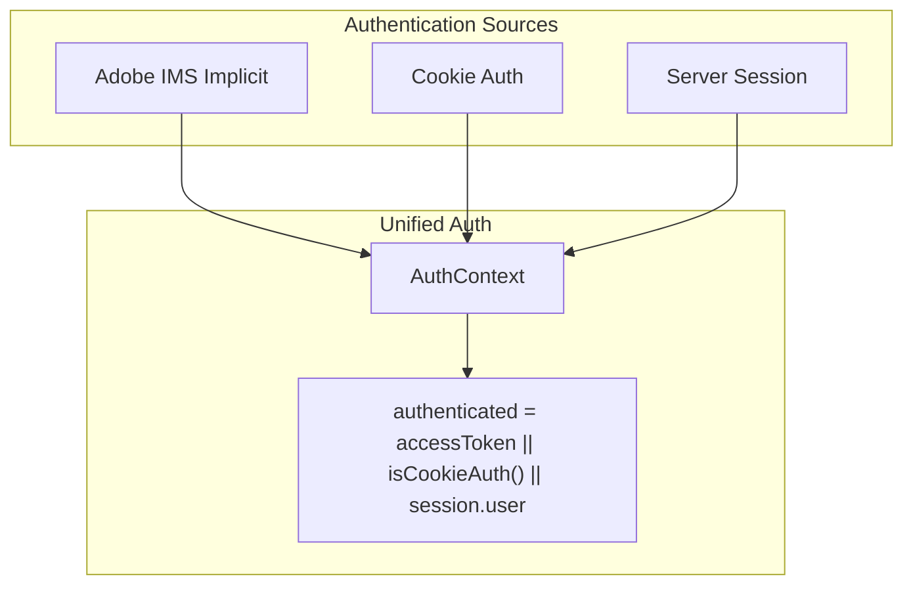

# Awesomeportal-Style Authentication for com_kit

## Current State vs Target


| Aspect           | Current com_kit         | awesomeportal                 | Target               |
| ---------------- | ----------------------- | ----------------------------- | -------------------- |
| Adobe IMS        | Auth code flow (server) | Implicit flow (client)        | Both                 |
| Token storage    | Session cookie          | localStorage                  | Both                 |
| Cookie auth      | None                    | *.adobeaem.workers.dev, :8787 | *.workers.dev, :8787 |
| Entra/Cloudflare | Yes                     | Worker only                   | Keep                 |


## Architecture




## Implementation Plan

### 1. Create Adobe IMS implicit flow component

**New file:** `[components/adobe-sign-in-button.jsx](components/adobe-sign-in-button.jsx)`

- Redirect to `https://ims-na1.adobelogin.com/ims/authorize/v2` with:
  - `response_type: token` (implicit flow)
  - `redirect_uri: window.location.href`
  - `scope: AdobeID,openid,read_organizations,additional_info.projectedProductContext`
- On mount: parse `#access_token` and `expires_in` from URL hash (and fallbacks: query, pathname)
- Store in `localStorage.accessToken` (value: `Bearer <token>`) and `localStorage.tokenExpiresAt`
- Replace URL with clean path (remove token from address bar)
- Silent refresh: hidden iframe with `prompt=none` ~5 min before expiry; `postMessage` handler
- Sign out: clear localStorage, call `onSignOut`
- Config: `NEXT_PUBLIC_ADOBE_CLIENT_ID` (no client secret needed for implicit)

**Note:** Adobe Developer Console must allow redirect URIs for your app origin (e.g. `https://localhost:3000/`* or `https://your-domain.com/`*).

### 2. Add cookie auth helper

**New file:** `[lib/auth/cookie-auth.js](lib/auth/cookie-auth.js)`

```javascript
export function isCookieAuth() {
  if (typeof window === 'undefined') return false;
  const origin = window.location.origin;
  return origin.endsWith('.workers.dev') || origin === 'http://localhost:8787';
}
```

### 3. Add IMS profile API (proxy)

**New file:** `[app/api/auth/ims/profile/route.js](app/api/auth/ims/profile/route.js)`

- `GET` with `Authorization: Bearer <token>` header
- Forward to `https://ims-na1.adobelogin.com/ims/userinfo/v2`
- Return user info (name, email, sub) for profile display

### 4. Refactor AuthContext to unify all auth sources

**File:** `[contexts/auth-context.jsx](contexts/auth-context.jsx)`

- **Initial state:** `accessToken` from `localStorage.getItem('accessToken')`; `authenticated = !!accessToken || isCookieAuth()`
- **On mount:**
  1. If `accessToken` and not expired → `authenticated = true`; fetch profile from `/api/auth/ims/profile` with Bearer token
  2. Else if `isCookieAuth()` → `authenticated = true`; user can be null or fetched from `/auth/user` (when on worker)
  3. Else fetch `/api/auth/session` (existing) for Entra/Adobe server session
- **authenticated** = `!!accessToken || isCookieAuth() || !!user` (from any source)
- **user** = from IMS profile, session, or null when cookie auth (optional: fetch from worker `/auth/user`)
- **signIn:** If IMS implicit configured → use `AdobeSignInButton` flow (redirect). Else → existing `signInUrl` (Entra/Adobe server)
- **signOut:** Clear `localStorage.accessToken` and `tokenExpiresAt`; if session-based, call existing signout; reset state

### 5. Update AuthBar to use AdobeSignInButton when IMS implicit is primary

**File:** `[components/auth-bar.jsx](components/auth-bar.jsx)`

- When `NEXT_PUBLIC_ADOBE_CLIENT_ID` is set and no Entra/Cloudflare: render `AdobeSignInButton` with `onAuthenticated`/`onSignOut` that update AuthContext
- Otherwise: keep current AuthBar (redirect to signInUrl, etc.)
- Or: always use a unified component that delegates to the right flow based on config

**Simpler approach:** AuthBar stays mostly the same. AuthContext handles the logic. Add `AdobeSignInButton` as an alternative sign-in trigger that can be used when IMS implicit is the chosen method. The AuthContext will expose `signIn` which either redirects (existing) or we need a way to trigger the IMS implicit redirect. For IMS implicit, `signIn` = `window.location.href = imsAuthorizeUrl`. So AuthContext can do that when IMS implicit is configured. We don't need a separate button component for the UI—we need the token parsing and storage logic. That can live in AuthContext's useEffect: on mount, check for token in URL, store it, clean URL. The sign-in is just a redirect. So:

- **AuthContext** includes logic to parse token from URL on mount (like AdobeSignInButton's useEffect)
- **AuthContext** includes silent refresh setup when token exists
- **signIn** for IMS implicit = redirect to IMS authorize URL
- **AuthBar** stays the same, calls `signIn` from context

### 6. Config and env

**File:** `[.env.example](.env.example)`

Add:

```
# Adobe IMS implicit flow (client-side, no secret)
# Redirect URI in Adobe Console: https://your-domain/* or https://localhost:3000/*
NEXT_PUBLIC_ADOBE_CLIENT_ID=
```

### 7. Preserve existing auth paths

- Keep `/api/auth/adobe`, `/api/auth/entra/*`, `/api/auth/session`, `/api/auth/signout`
- Keep Cloudflare Worker auth
- Session route continues to return `user`, `authProvider`, `signInUrl`, `logoutUrl` for server-based auth
- AuthContext merges: if `accessToken` or `isCookieAuth()` first, else fall back to session

### 8. Priority order for "authenticated"

1. `localStorage.accessToken` (valid, not expired) → IMS implicit
2. `isCookieAuth()` → cookie auth
3. Session (from `/api/auth/session`) → Entra or Adobe server

For `user` (profile): IMS profile API when accessToken; session user when session; null for cookie auth unless we fetch from worker.

## Files to Create


| File                                  | Purpose                                                            |
| ------------------------------------- | ------------------------------------------------------------------ |
| `components/adobe-sign-in-button.jsx` | IMS implicit flow: redirect, parse token, silent refresh, sign out |
| `lib/auth/cookie-auth.js`             | `isCookieAuth()` for *.workers.dev and localhost:8787              |
| `app/api/auth/ims/profile/route.js`   | Proxy to IMS userinfo with Bearer token                            |


## Files to Modify


| File                           | Changes                                                                              |
| ------------------------------ | ------------------------------------------------------------------------------------ |
| `contexts/auth-context.jsx`    | Add accessToken, isCookieAuth, IMS token parsing, silent refresh, merge with session |
| `components/auth-bar.jsx`      | Use IMS implicit sign-in when configured; wire to context                            |
| `.env.example`                 | Add NEXT_PUBLIC_ADOBE_CLIENT_ID                                                      |
| `docs/adobe-authentication.md` | Document implicit flow option                                                        |


## Token parsing (in AuthContext or AdobeSignInButton)

On mount, check `window.location.hash`, `window.location.search`, and pathname for `access_token`. If found: store, clean URL, setup refresh, set authenticated. Handle `error` and `error_description` in response.

## Silent refresh

- When token exists and `Date.now() >= tokenExpiresAt - 5min`, run silent refresh
- Hidden iframe to IMS authorize with `prompt=none`
- Listen for `postMessage` from `ims-na1.adobelogin.com`
- Parse new token from event data URL, update localStorage, reschedule

