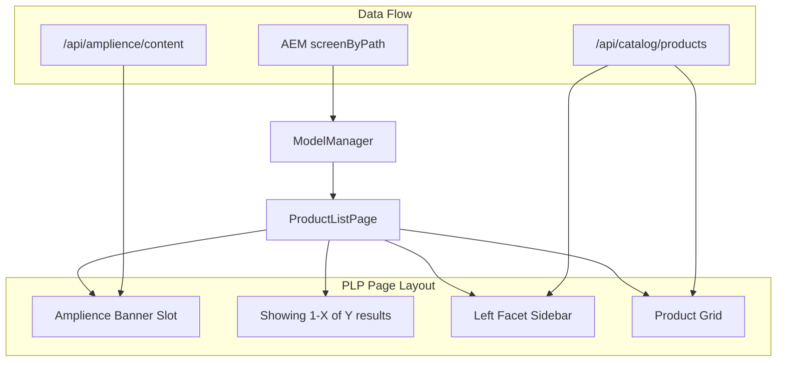

# PLP Edit Pencil, Banner Slots, and Facet Filters

## Current State

- **PLP routing**: [app/[...slug]/page.js](app/[...slug]/page.js) fetches AEM content via `screenByPath` for paths like `/content/dam/v0/site/en/new-arrivals/new-arrivals`. The screen's `block` array is rendered via [ModelManager](components/model-manager.jsx); a `ProductCollectionList` block maps to [ProductListPage](components/product-list-page/product-list-page.js).
- **ProductListPage**: Renders header (title, subtitle), search, category dropdown, sort, price book, "Showing 1-X of Y results", and product grid. No edit pencil, no banner slots, no left-hand facets.
- **Product API**: [lib/api/plp.ts](lib/api/plp.ts) uses `productSearch` with `phrase`, `filter`, `sort`, `page_size`, `current_page`. Products have `attributes` (including `item_category`), `price`, etc. The current query does not request facets.

## 1. Edit Pencil for PLP

**Goal**: Show pencil icon on the right side of the PLP when `?vse=` is in the URL; clicking opens AEM editor for the PLP content.

**Changes**:

- Add `ProductCollectionList` to `EDITABLE_BLOCK_TYPES` in [components/model-manager.jsx](components/model-manager.jsx) with label `"product list"`.
- The ModelManager already wraps editable blocks with [EditPencilWrapper](components/amplience/edit-pencil-wrapper.jsx) when `content._path` and `config.env` exist. ProductListPage will inherit this.
- **Layout**: The pencil is `absolute top-2 right-2` on the wrapper. For PLP, the wrapper will be around the whole ProductListPage. To place it "on the right side of the page", ensure the PLP root has `position: relative` (or the wrapper provides it). The existing EditPencilWrapper uses `relative` on its div, so the pencil will appear top-right of the PLP section. If the user wants it fixed to the viewport right edge, we could add a variant (e.g. `position: fixed right-4 top-1/2` for PLP only).

**Recommendation**: Use the same pattern as other blocks (top-right of the PLP section). If a fixed right-side position is preferred, add an optional prop to EditPencilWrapper (e.g. `position="fixed"`).

---

## 2. Banner Slots Above Results Count

**Goal**: Add Amplience banner slot(s) above "Showing 1-23 of 23 results".

**Approach**: Fetch Amplience content by delivery key and render above the results header.

**Delivery key pattern**: `plp/slot/top` (global) or `plp/{categorySlug}/slot/top` (category-specific). The slug for `/content/dam/v0/site/en/new-arrivals/new-arrivals` would yield `new-arrivals` as a segment. We can derive a key like `plp/new-arrivals/slot/top` or fall back to `plp/slot/top`.

**Changes**:

- In [components/product-list-page/product-list-page.js](components/product-list-page/product-list-page.js):
  - Accept optional `categorySlug` or derive from `content._path` (e.g. last segment of path).
  - Add state + `useEffect` to fetch `/api/amplience/content?key=plp/slot/top` (and optionally `plp/{slug}/slot/top`).
  - Render `<AmplienceWrapper fetch={{ key }} />` in a new `plp-banner-slot` div **above** the `results-header` div (around line 299).
- Style the slot in [components/product-list-page/product-list-page.css](components/product-list-page/product-list-page.css) (e.g. `margin-bottom`, full-width).

**Amplience setup**: Create content items with delivery keys `plp/slot/top` and optionally `plp/new-arrivals/slot/top`. Map schema to Hero/Banner component in AmplienceWrapper if not already present.

---

## 3. Left-Hand Facet Filters

**Goal**: Add a left sidebar with facets similar to [Mobify reference](https://ascc-production.mobify-storefront.com/global/en-GB/category/newarrivals-womens?limit=24&sort=best-matches): Category, Shop by Color, Shop by Price, Shop by Size, with counts where applicable.

**API extension**:

- The [Adobe Commerce Live Search](https://developer.adobe.com/commerce/webapi/graphql/schema/live-search/queries/product-search/) `productSearch` returns `facets` when using the Live Search schema. The current app uses a different `productSearch` (productView / Catalog Service) at `ACO_URL`.
- **Option A**: If the Commerce API at ACO_URL supports a `facets` or `aggregations` field in the productSearch response, extend [lib/api/plp.ts](lib/api/plp.ts) to request it and pass `filter` based on selected facets.
- **Option B**: If the current API does not support facets, integrate with Live Search (different endpoint/schema) for PLP search when available; otherwise compute facets client-side from product attributes as a fallback.

**Implementation steps**:

1. **Extend productSearch in [lib/api/plp.ts](lib/api/plp.ts)**:
  - Add `filter` parameter (array of `{ attribute, in?: string[], range?: { from, to } }`) to `searchProducts`.
  - Check Commerce/Live Search docs for facet/aggregation fields. If supported, add to the GraphQL query and parse response.
  - Add a new function `searchProductsWithFacets(phrase, filter, sort, pageSize, currentPage)` that returns `{ products, totalCount, facets }` where `facets` is e.g. `{ category: [{ value, count }], color: [...], price: [{ from, to, count }], size: [...] }`.
2. **Expose via API route**: Create or extend [app/api/catalog/products/route.js](app/api/catalog/products/route.js) to accept `filter`, `sort`, and return facets if the backend supports it.
3. **ProductListPage layout**:
  - Change layout to a two-column grid: left sidebar (~240px) for facets, right content for results.
  - Add `PlpFacets` component: sections for Category, Color, Price, Size. Each facet shows options with counts; selecting updates URL params or state and triggers a new search with filters.
  - Wire `searchProducts`/`searchProductsWithFacets` to use `filter` from selected facets.
  - Match Mobify-style UI: collapsible sections, checkboxes, price ranges, sort dropdown in results header.

**Facet data source** (if API does not return facets):

- **Category**: From `item_category` attribute; aggregate from products.
- **Color**: From attributes matching `color`, `colour`, `variant_color`, etc.
- **Size**: From attributes matching `size`, `variant_size`, etc.
- **Price**: Bucket products into ranges (e.g. 0–20, 20–50, 50–100, 100+); compute from `price.final.amount.value`.

---

## File Summary

| File                                                                                                     | Changes                                                                                                                    |
| -------------------------------------------------------------------------------------------------------- | -------------------------------------------------------------------------------------------------------------------------- |
| [components/model-manager.jsx](components/model-manager.jsx)                                             | Add `ProductCollectionList` to `EDITABLE_BLOCK_TYPES` and `BLOCK_LABELS`                                                   |
| [components/product-list-page/product-list-page.js](components/product-list-page/product-list-page.js)   | Add Amplience banner slot above results; add left-hand facets; integrate filter state with search                          |
| [components/product-list-page/product-list-page.css](components/product-list-page/product-list-page.css) | Two-column layout; facet sidebar styles                                                                                    |
| [lib/api/plp.ts](lib/api/plp.ts)                                                                         | Add `filter` param to `searchProducts`; add facet request/parsing if API supports it; or add client-side facet computation |
| [app/api/catalog/products/route.js](app/api/catalog/products/route.js)                                   | Accept `filter`, `sort`; return facets if available                                                                        |
| New: `components/product-list-page/plp-facets.jsx`                                                       | Facet UI component (Category, Color, Price, Size)                                                                          |
| [components/amplience/wrapper/index.jsx](components/amplience/wrapper/index.jsx)                         | Ensure Hero/Banner schema mapping for PLP slot content (if needed)                                                         |

---

## Architecture Diagram

---

## Dependencies and Risks

- **Facets**: Commerce API facet support must be verified. If the current `productSearch` (productView schema) does not return facets, we will need either Live Search integration or client-side facet computation.
- **Amplience**: Requires content items and schema for PLP banner slot. Hero/Banner components must be mapped in AmplienceWrapper.
- **Category slug**: Derive from `content._path` or pass from slug page (e.g. `new-arrivals` from URL path).

