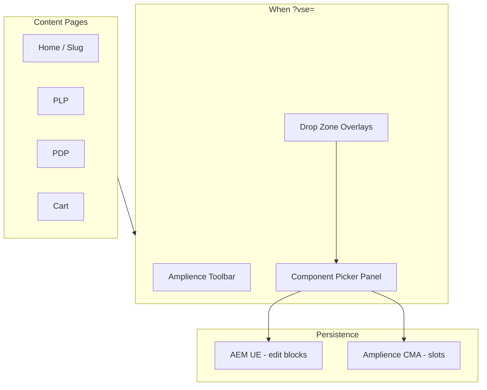

# VSE Drop Placements and Component Picker

## Current state

- **AEM**: Page structure from `content.block`; blocks rendered via [ModelManager](components/model-manager.jsx) (Hero, ProductCollection, CategoryGrid, ProductCollectionList). Each block has `data-aue-resource` for UE.
- **Amplience**: Carousel, PLP banner, PDP content via delivery keys. [AmplienceWrapper](components/amplience/wrapper/index.jsx) maps schema to components. CMA supports update only (no create).
- **?vse=**: Shows [AmplienceToolbarWhenVse](components/amplience/toolbar-when-vse.jsx) and EditPencilWrapper on Amplience content.
- **Cart**: Has `data-slot` placeholders (cart-banners, cart-coupons, cart-upsell) but not wired to Amplience.

## Architecture

## 1. Drop placements (drop zones)

### 1a. Between AEM blocks (home, slug)

Insert drop zones **between** each block and at top/bottom of the main content area. When ?vse=:

- Render a thin clickable strip (e.g. dashed border, "Add component" on hover) between blocks.
- Each zone has a slot identifier: `home/body/slot/{index}` or `{pageKey}/body/slot/{index}`.
- Clicking opens the component picker (or inline "Add" menu) scoped to that slot.

**Files**: [app/page.jsx](app/page.jsx), [app/[...slug]/page.js](app/[...slug]/page.js)

### 1b. PLP, PDP, Cart

- **PLP**: Drop zones above banner slot, between banner and grid, below grid. Keys: `plp/{slug}/slot/top` (exists), `plp/{slug}/slot/mid`, `plp/{slug}/slot/bottom`.
- **PDP**: Drop zones above product, between product and cross-sell, below cross-sell. Keys: `pdp/content/{SKU}` (exists), add `pdp/slot/{SKU}/top`, `pdp/slot/{SKU}/bottom`.
- **Cart**: Wire existing `data-slot` divs to Amplience: `cart/slot/banners`, `cart/slot/coupons`, `cart/slot/upsell`. When ?vse=, show drop zone overlay.

**Files**: [components/product-list-page/product-list-page.js](components/product-list-page/product-list-page.js), [components/product-detail/product-detail.jsx](components/product-detail/product-detail.jsx), [app/cart/page.jsx](app/cart/page.jsx)

### 1c. Drop zone component

Create `components/amplience/drop-zone.jsx`:

- Props: `slotKey`, `label`, `children`, `isEmpty`
- When ?vse= and `isEmpty`: render overlay with "Add component" button.
- When ?vse= and has content: render subtle "Edit" affordance.
- Renders `children` (AmplienceWrapper or placeholder) inside.

## 2. Component picker

### 2a. New panel in Amplience toolbar

Add a **"Components"** accordion panel to [components/amplience/toolbar/index.jsx](components/amplience/toolbar/index.jsx):

- Lists all available components with icons/labels:
  - **Amplience**: Banner, Hero (tutorial), Carousel, Teaser (if schema exists)
  - **AEM**: Hero, ProductCollection, CategoryGrid (link to AEM editor / UE)
- Each Amplience item: "Add" opens Content Studio create flow or storefront dialog to create + assign to slot.
- Each AEM item: "Edit in AEM" links to `editor.html?path=...` (existing pattern).

### 2b. Component registry

Create `lib/amplience/component-registry.js`:

- Export `AMPLIENCE_COMPONENTS`: `{ schemaUri, label, icon, createDefaultBody }`
- Export `AEM_BLOCK_TYPES`: `{ modelTitle, label, editorUrlBuilder }`
- Used by picker and by AmplienceWrapper for schema mapping.

### 2c. Add-to-slot flow (Amplience)

When user picks "Banner" (or Carousel, etc.) for a slot:

1. **Option A (recommended)**: Open Amplience Content Studio in new tab with create URL for that content type; user creates content, sets delivery key to slot (e.g. `home/body/slot/1`). Storefront refetches and renders.
2. **Option B**: Storefront dialog creates content via CMA (requires `createContentItem` in [lib/amplience/cma.js](lib/amplience/cma.js)) and assigns delivery key. More seamless but needs CMA create + schema IDs.

Extend CMA with `createContentItem(contentTypeId, body, deliveryKey)` for Option B.

## 3. AEM Universal Editor drop zones

Enhance UE instrumentation for insert-between behavior:

- Add `data-aue-filter` to the main container in [app/page.jsx](app/page.jsx) and [app/[...slug]/page.js](app/[...slug]/page.js) referencing a filter that allows Hero, ProductCollection, CategoryGrid, etc.
- Add `<script type="application/vnd.adobe.aue.filter+json" src="/filter-definition.json">` in layout or page.
- Create `public/filter-definition.json` and `public/component-definition.json` (if needed) per [AEM UE filtering docs](https://experienceleague.adobe.com/en/docs/experience-manager-cloud-service/content/implementing/developing/universal-editor/filtering).

This enables authors opening the app from AEM UE to insert AEM blocks via the UE UI. No storefront component picker needed for AEM—UE provides it.

## 4. Page-specific slot keys

| Page | Slot keys                                                          |
| ---- | ------------------------------------------------------------------ |
| Home | `home/body/slot/0`, `home/body/slot/1`, ... (between blocks)       |
| Slug | `{slug}/body/slot/0`, ... (derive from content path)               |
| PLP  | `plp/{slug}/slot/top`, `plp/slot/top` (fallback)                   |
| PDP  | `pdp/content/{SKU}`, `pdp/slot/{SKU}/top`, `pdp/slot/{SKU}/bottom` |
| Cart | `cart/slot/banners`, `cart/slot/coupons`, `cart/slot/upsell`       |

## 5. Implementation order

1. **DropZone component** – Reusable overlay when ?vse= and slot empty.
2. **Component registry** – Central list of Amplience + AEM components.
3. **Component picker panel** – New toolbar panel; "Add" deep-links to Content Studio (Option A).
4. **Wire drop zones on home/slug** – Between blocks, fetch by slot key, render AmplienceWrapper or placeholder.
5. **Wire drop zones on PLP, PDP, cart** – Use existing slot keys where possible; add new keys for extra zones.
6. **AEM UE filter** – filter-definition.json + data-aue-filter on container.
7. **(Optional)** CMA create – If Option B desired, add `createContentItem` and in-storefront create flow.

## Key files to create/modify

| File                                                | Action                                                 |
| --------------------------------------------------- | ------------------------------------------------------ |
| `components/amplience/drop-zone.jsx`                | Create – drop zone overlay + slot fetch                |
| `components/amplience/toolbar/components-panel.jsx` | Create – component picker UI                           |
| `lib/amplience/component-registry.js`               | Create – component list                                |
| `components/amplience/toolbar/index.jsx`            | Modify – add Components panel                          |
| `app/page.jsx`, `app/[...slug]/page.js`             | Modify – insert DropZone between blocks                |
| `components/product-list-page/product-list-page.js` | Modify – wrap banner slot in DropZone                  |
| `app/cart/page.jsx`                                 | Modify – wrap slot divs in DropZone + AmplienceWrapper |
| `public/filter-definition.json`                     | Create – AEM UE filter                                 |
| `lib/amplience/cma.js`                              | Modify – add createContentItem (optional)              |

